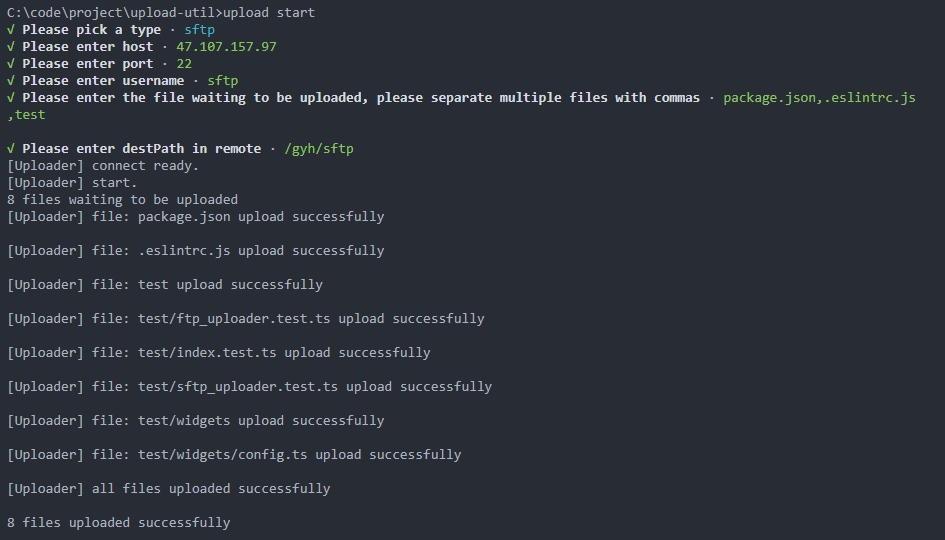

# 文件上传
[](https://travis-ci.com/hangboss1761/upload-util) [](https://coveralls.io/github/hangboss1761/upload-util) [](https://github.com/hangboss1761/upload-util)
## Install

```bash
yarn add node-upload-util
# or
yarn add global node-upload-util
```
## Usage

- Use in cli



- Import in your code

```js
import { run } from 'node-upload-util';

run({
  ftp: {
    host: '1.1.1.1',
    port: 21,
    user: 'username',
    password: '123456',
    files: ['file.txt', 'dir'],
    rootPath: '/',
    destRootPath: '/home/ftp'
  },
  sftp: {
    host: '1.1.1.1',
    port: 22,
    user: 'username',
    password: '123456',
    files: ['file.txt', 'dir'],
    rootPath: '/',
    destRootPath: '/home/sftp'
  },
})
```

or like this

```ts
import { FtpUploader } from 'node-upload-util/ftp_uploader';
import * as glob from 'glob';

const start = async () => {
  const uploader = new FtpUploader({
    host: 'ftp.dlptest.com',
    port: 21,
    user: 'dlpuser@dlptest.com',
    password: 'eUj8GeW55SvYaswqUyDSm5v6N',
    destRootPath: '/'
  });

  uploader.on('upload:ready', () => console.log('connect ready'))
  uploader.on('upload:destory', () => console.log('destoryed'))

  const files = glob.sync('test');
  await uploader.connect();

  for (const filePath of files) {
    await uploader
      .upload(filePath)
      .then(() => console.log(`${filePath} uploaded success`));
  }

  uploader.destory();
};

start();
```

## API

```ts
export interface Options {
  host: string;
  port: number;
  user: string;
  password: string;
  files?: string[];
  destRootPath: string;
  rootPath?: string;
  parallel?: boolean;
  retry?: boolean;
  retryTimes?: number;
}
```
|事件名|功能|参数|
|---|---|---|
|`upload:connecting`|服务器连接中|无|
|`upload:ready`|连接服务器成功|无|
|`upload:start`|调用上传接口触发|`options`:用户配置，`files`: 上传文件列表|
|`upload:file`|单个文件、目录上传成功触发|`options`:用户配置,`files`: 上传文件列表, `filePath`:成功上传的文件、目录本地路径|
|`upload:success`|所有文件上传成功时触发|`options`:用户配置，`files`: 上传文件列表|
|`upload:failure`|所有文件上传失败时触发|`options`:用户配置，`e`:错误信息|
|`upload:destroy`|销毁时触发|无|

## 函数式编程实现

[函数式编程实现](./src/fp/README.md)

## Dev

```bash
# clone code
git clone https://github.com/hangboss1761/upload-util

cd upload-util

# install dependencies
yarn

# start dev mode
yarn dev

# build for production
yarn build
```

- cli

```bash
npm link

upload start
```

## Test

```bash
yarn test
# or
yarn test:cover
```

