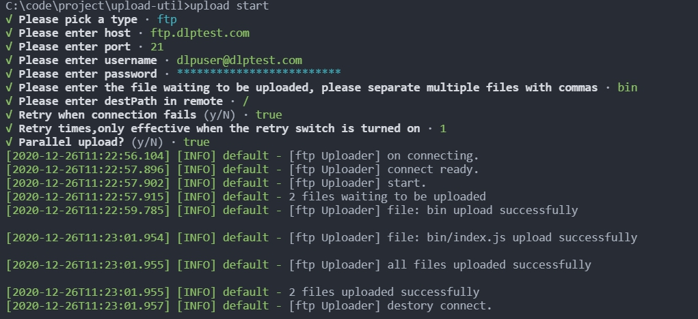

# 文件上传

## Install

**暂未发包**，以下仅供参考
```bash
yarn add file-upload-util
# or
yarn add global file-upload-util
```
## Usage

- Use in cli



- Import in your code

```js
import { run } from 'file-upload-util';

run({
  ftp: {
    host: '1.1.1.1',
    port: 21,
    user: 'username',
    password: '123456',
    files: ['file.txt', 'dir'],
    rootPath: '/',
    destRootPath: '/home/ftp'
  },
  sftp: {
    host: '1.1.1.1',
    port: 22,
    user: 'username',
    password: '123456',
    files: ['file.txt', 'dir'],
    rootPath: '/',
    destRootPath: '/home/sftp'
  },
})
```

## Dev

```bash
# clone code
git clone xxxx

cd upload-util

# install dependencies
yarn

# start dev mode
yarn dev

# build for production
yarn build
```

- cli

```bash
npm link

upload start
```

## Test

```bash
yarn test
# or
yarn test:cover
```